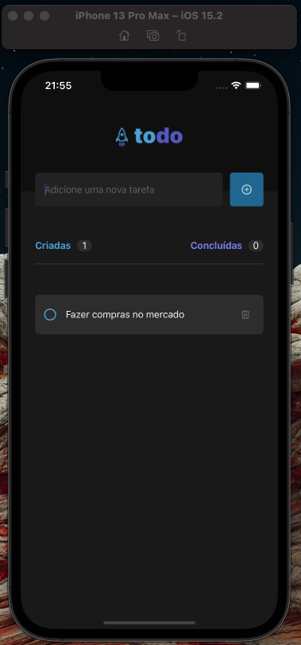
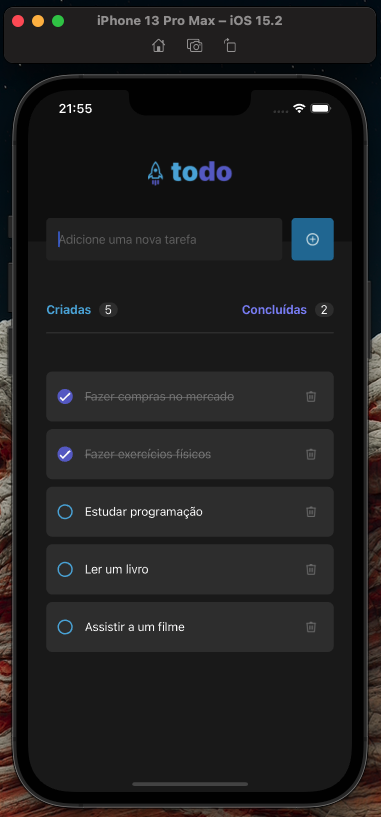
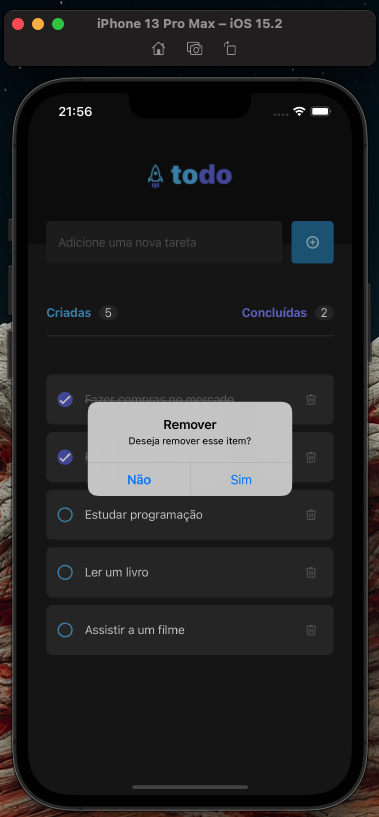

# Todo App - React Native

<p align="center">
  
</p>

## Description

This is a simple Todo app built using React Native with Expo. The app allows users to create new tasks, mark them as completed, and delete them.

## Installation

To install and run the app locally, please follow these steps:

Clone the repository: 

```bash
git clone https://github.com/jefersonwillian/iginite-rn-01-todo-list.git
```

Enter the project folder:

```bash
 cd iginite-rn-01-todo-list
```
Install the dependencies:

```bash
npm install
```

Start the development server:

```bash
expo start
```

Run the app on an emulator or physical device using one of the following commands:
Follow the instructions in the Expo Developer Tools to run the app on an emulator or physical device.

```bash
expo android
```

or

```bash
expo ios
```

## Usage

When the app is running, you will be presented with a list of tasks that have been added. To add a new task, simply click the "Add" button in the top-right corner of the screen. This will open a modal where you can enter the title of the new task.

To mark a task as completed, simply click on the checkbox next to the task. To delete a task, swipe left on the task and click the "Delete" button that appears.

## Screens

<p align="center">
    
    
    
</p>


## Contributing

If you would like to contribute to this project, please open an issue or submit a pull request. All contributions are welcome!

## License

This project is licensed under the MIT license. See the LICENSE file for more details.

## Author

`Todo App` was developed by Jeferson Carvalho.
